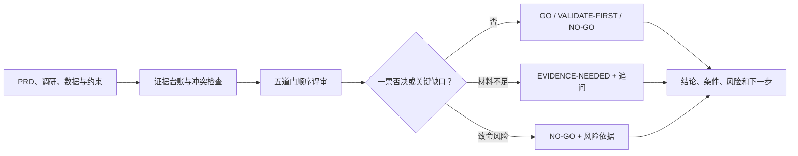

# AI项目立项评估五道门

Enterprise AI Project Assessor

面向企业 AI 产品经理的 Codex Skill：通过五道门判断一个 AI 需求是否值得立项，并输出 `GO`、`VALIDATE-FIRST` 或 `NO-GO`、证据缺口与最低成本验证计划。

> 当前版本：`v1.0.0`。20 条规则回归测试全部通过；针对首轮偏差修复后，第二轮三个全新独立会话的核心决策、定向修复断言和当前严格用例均全部通过。

## 适合谁

- **企业 AI 产品经理／AIPM**：把业务需求转化为可评审的 AI 项目，并判断是否应进入下一阶段。
- **业务负责人、数字化负责人和创新团队**：在投入预算与研发资源前，识别真实价值、关键假设和致命风险。
- **算法、研发与架构负责人**：把业务节点映射为规则、人工与 AI 分工，并评审技术路线和验证口径。
- **财务、运营、数据、法务与风控协作团队**：共同检查 ROI、数据责任、权限边界、人工兜底和退出机制。

## 适用场景

- 收到一个企业 AI 构想、业务需求或项目提案，想先判断“值不值得做”。
- 已有 PRD、用户访谈、业务数据或项目复盘，需要进行正式立项评审。
- 在 Demo、POC、MVP、试点、生产上线或规模化扩量前，判断能否进入下一阶段。
- 需要还原现有业务流程，确定哪些节点适合规则、人工或 AI，以及是否真的有必要使用 AI。
- 需要选择 AIGC、RAG、Workflow、Agent 与模型组合，并设计代表性 Demo／POC 验证。
- 材料不足或证据冲突，无法直接决策，需要输出关键证据缺口和最低成本验证计划。
- 项目涉及高风险决策、生产写权限、价格或赔偿等场景，需要检查一票否决、人工审批和运营兜底。

## 不适用场景

- 只需要撰写普通非 AI 功能 PRD、界面文案或原型说明，不涉及是否立项的判断。
- 只做孤立的模型跑分或技术选型，不评估业务价值、投资回报和上线治理。
- 希望在缺少证据时直接获得肯定结论，或把案例中的数据当作当前项目事实。
- 需要法律、医疗、财务、安全等顾问或企业授权责任人代为作出最终审批；本 Skill 只能辅助评审，不能替代专业签字。

## 为什么做这个 Skill

企业 AI 项目常见的问题不是“模型能不能演示”，而是需求是否真实、AI 是否优于规则或人工、方案能否在真实业务分布下稳定工作、规模化收益能否覆盖总成本，以及上线后是否有人运营和兜底。

这个 Skill 将立项评审封装为一套可复用、可追溯的决策流程，避免用模型演示效果、单点准确率或模糊的降本叙事代替立项证据。

## 五道门

| 决策门 | 核心问题 | 关键产出 |
| --- | --- | --- |
| 1. 真需求判断 | 谁在什么场景下遇到什么问题，频次、当前方案、根因、痛点与损失是否有证据？ | 问题定义、业务目标、北极星指标、证据缺口 |
| 2. AI 必要性 | 还原业务流程后，哪些节点适合规则、人工或 AI？AI 是否带来不可替代的增量价值？ | 规则／人工／AI 分工，以及能力、权限、信息边界 |
| 3. 技术选型与可行性 | 应选择 AIGC、RAG、Workflow、Agent 的哪种组合和什么模型？能否通过代表性 Demo／POC？ | 技术方案、评测口径、失败模式、可行性结论 |
| 4. 阶段投入与规模 ROI | 当前阶段的投入是否值得，规模化后的收益能否覆盖采用率、兑现率和 TCO？ | 阶段投入结论、规模 ROI、回收期、敏感性因素 |
| 5. 运营、数据与兜底 | 数据和知识如何更新，谁负责监控，失败时如何转人工、回滚、止损和退出？ | 运营闭环、责任人、监控指标、人工兜底与退出机制 |

五道门按顺序评审。重大合规、安全、权限或不可接受的失败模式可触发一票否决；加权总分不能覆盖致命风险。

## 决策口径

- `GO`：关键事实和可执行条件已经成立，可进入明确范围的下一阶段。
- `VALIDATE-FIRST`：方向有潜力，但关键假设尚未验证；先完成限定成本、周期和通过阈值的验证。
- `NO-GO`：核心价值不成立、存在不可接受风险，或在当前范围与条件下不值得继续。
- `EVIDENCE-NEEDED`：材料不足，尚不能形成上述三类立项结论；它是评估状态，不是第四种业务决策。

所有结论都绑定具体的项目阶段、业务范围和前置条件，避免把“可以做 Demo”误写成“可以规模化上线”。

## 工作方式



Skill 会区分已验证事实、文档陈述、相关方口述、假设、未知项和冲突证据。材料缺失不会自动等于“不通过”，案例中的数字也不会被带入新项目作为事实。

## 项目亮点

- **业务决策抽象**：把分散的调研、方案、财务和运营问题沉淀为五道可复用的阶段门。
- **AI 产品方案能力**：先完成人工／规则／AI 分工，再进入 RAG、Workflow、Agent、AIGC 和模型选型。
- **可控性设计**：显式定义证据等级、信息不足、证据冲突、一票否决和高风险权限边界。
- **工程化与评测**：将方法论拆为输入输出契约、执行规则、兜底层和案例库，并用三类输入及断言做回归测试。

## 仓库结构

```text
.
├── assess-enterprise-ai-project/
│   ├── SKILL.md                    # 索引、输入输出契约与执行工作流
│   ├── agents/openai.yaml          # Codex 展示与调用配置
│   └── references/
│       ├── five-gates.md           # 五道门评审标准
│       ├── decision-rules.md       # 决策与一票否决规则
│       ├── evidence-fallback.md    # 缺失、冲突和降级评估机制
│       ├── output-template.md      # 固定输出模板
│       └── case-library.md         # 脱敏／模拟案例库
└── tests/
    ├── inputs/                     # 三类模拟输入
    ├── expected/                   # 可审计断言
    ├── outputs/                    # 示例评审结果
    └── results/                    # 回归测试记录
```

## 安装到 Codex

### 方法一：使用 Skill Installer

在 Codex 中输入 `$skill-installer`，并发送：

```text
请安装这个 Skill：
https://github.com/hope138/enterprise-ai-project-assessor/tree/main/assess-enterprise-ai-project
```

安装完成后新建一个 Codex 任务，以便重新加载 Skill 列表。

### 方法二：本地链接（macOS / Linux）

```bash
git clone https://github.com/hope138/enterprise-ai-project-assessor.git
cd enterprise-ai-project-assessor
ln -s "$PWD/assess-enterprise-ai-project" ~/.codex/skills/assess-enterprise-ai-project
```

## 如何调用

显式调用：

```text
$assess-enterprise-ai-project

请评估下面这个企业 AI 项目是否值得立项。当前阶段是 POC 决策，材料包括 PRD、用户访谈、业务数据和安全约束……
```

也可以直接提出“这个 AI 项目是否值得做”“请评审这份 PRD 能否立项”等问题，由 Codex 根据 Skill 的 description 自动匹配。

建议至少提供：项目名称和当前阶段、目标用户与业务流程、问题证据、现有方案、期望指标、数据与系统条件、成本收益假设，以及运营／合规约束。缺失时 Skill 会优先追问影响决策的关键信息，并在无法补充时降级评估。

## 输出内容

- 执行结论、适用范围、前置条件与置信度
- 证据台账和证据冲突
- 五道门逐门状态、证据、阻塞项与判断
- 一票否决检查和致命风险
- `VALIDATE-FIRST` 对应的最低成本验证计划
- 下一阶段动作、责任人建议和停止条件

## 测试与示例

当前包含三条决策路径的模拟测试：

| 场景 | 预期结论 | 输入 | 示例输出 |
| --- | --- | --- | --- |
| 服饰商品上新文案 Copilot | `GO` | [测试输入](tests/inputs/01-apparel-listing-copilot.md) | [评审结果](tests/outputs/01-apparel-listing-copilot-assessment.md) |
| 服饰趋势洞察与设计平台 | `VALIDATE-FIRST` | [测试输入](tests/inputs/02-fashion-trend-design.md) | [评审结果](tests/outputs/02-fashion-trend-design-assessment.md) |
| 跨渠道自主调价 Agent | `NO-GO` | [测试输入](tests/inputs/03-cross-channel-pricing-agent.md) | [评审结果](tests/outputs/03-cross-channel-pricing-agent-assessment.md) |

现有规则回归共 20 条断言，结果为 20 通过、0 失败，详见[回归记录](tests/results/2026-09-05-regression.md)。

2026-09-06 在三个全新、隔离的 Codex 任务中完成首轮独立盲测：三类核心决策 `3/3` 命中，发现最小验证范围、证据分类、`NO-GO` 证据充分度和第一门状态四项规则偏差。详见[首轮独立盲测记录](tests/results/2026-09-06-independent-blind-test.md)及[首轮原始输出](tests/outputs/blind/)。

修复后又在三个全新的独立 Codex 会话中完成第二轮前向测试：核心决策 `3/3`、四项定向修复 `4/4`、按当前规则校准后的严格用例 `3/3` 通过。测试期间不修改锁定的模型原始输出；同时记录并修正了一个与新证据边界冲突的旧测试预言。详见[第二轮独立盲测记录](tests/results/2026-09-06-independent-blind-test-round-2.md)及[第二轮原始输出](tests/outputs/blind-round-2/)。这些结果来自模拟场景和单次运行，不描述为真实行业基准。

## 使用边界

- 案例和模拟数据仅用于展示决策方法，不代表通用行业基准。
- 输出是立项辅助意见，不替代企业内部的财务、法务、安全、隐私和业务负责人审批。
- 对高风险、零容错或涉及资金赔偿、价格承诺等权限场景，应由确定性系统或授权人员做最终决策。

## License

本项目采用 [MIT License](LICENSE)。
